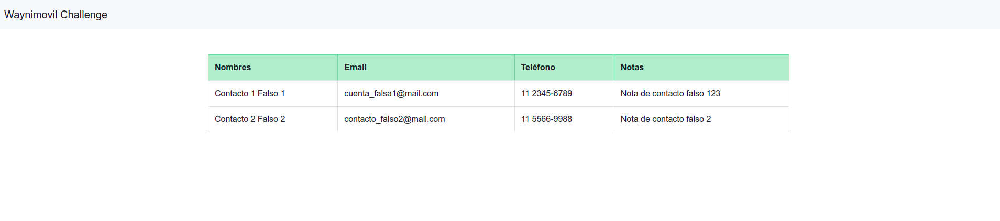

## Waynimóvil Challenge

### Observaciones sobre el proyecto
El proyecto fué desarrollado utilizando el framework Laravel en su versión 6,
se utilizó la librería [Sociliate](https://laravel.com/docs/6.x/socialite) para realizar el
manejo del social login, en este caso se crea el driver Google.

Se utiliza Docker para poder levantar el ambiente de desarrollo y se seleccionó 
como imagen [WebDevops](https://dockerfile.readthedocs.io/en/latest/content/DockerImages/dockerfiles/php-nginx-dev.html)

### Ejecutar ambiente de desarrollo y configuraciones

1. Generar archivo de environment de Laravel necesarias en el proyecto `cp .env.example .env`
2. El proyecto contiene un archivo `docker-compose.yml`, 
que tiene la estructura del servicio. 
Para ejecutar el proyecto, se deberá correr, sobre la raíz del proyecto, el comando `docker-compose up -d --build`
3. Instalar dependencias del proyecto `docker exec wayni_app composer install --prefer-dist --no-interaction`
4. Generar key del proyecto `docker exec wayni_app php artisan key:generate`
5. Setear las variables de entorno `GOOGLE_OAUTH_CLIENT` y `GOOGLE_OAUTH_SECRET`con los valores indicados por email
6. En un navegador dirigirse a http://localhost:2912/ para comenzar a operar el proyecto

